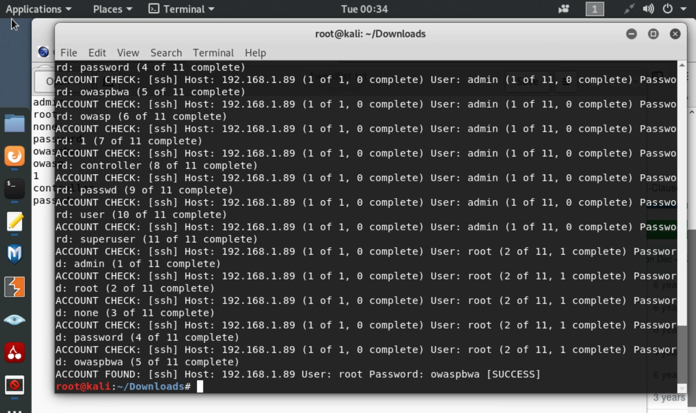
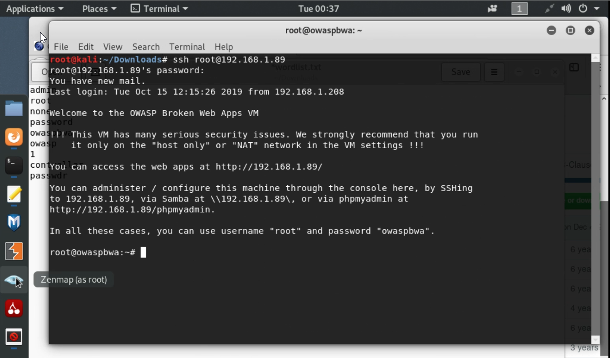
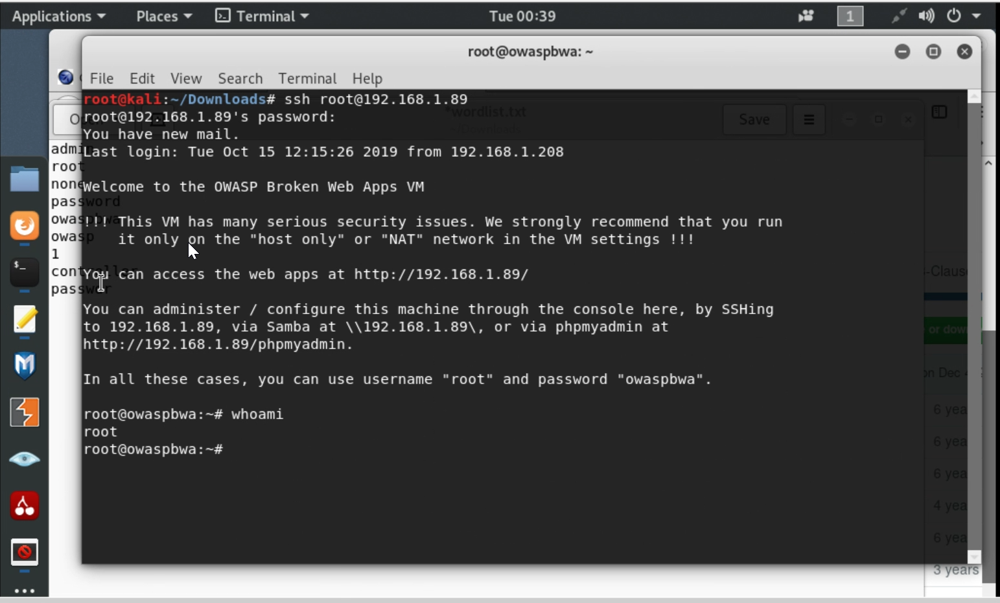

Jarron Bailey

<h1 align="center">Assingment 4</h1>

- [Wordlist Generation](#wordlist-generation)
- [Selecting a program](#selecting-a-program)
- [Execution](#execution)
- [Results](#results)
- [Penetration](#penetration)
  - [Whoami](#whoami)

---

## Wordlist Generation

This step was simple, I created a wordlist of users common root level usernames.  
Also, observing the index page hosted @ the IP address [192.168.1.89](192.168.1.89), I was able to extract and add a few keywords.

```shell
user
admin
root
superuser
none
password
passwd
owasp
owaspbwa
1
controller
```

---

## Selecting a program

The program I choose to attack the OWASPBWA VM is [Medusa](https://en.kali.tools/?p=200)  
Medusa: a speedy, parallel, and modular, login brute-forcer. The goal is to support as many services which allow remote authentication as possible.
Features:

  -  Thread-based parallel testing.
  -  Flexible user input.
  -  Modular design.
  -  Multiple protocols supported. Many services are currently supported (e.g. SMB, HTTP, POP3, MS-SQL, SSHv2, among others)

---

## Execution

Command used  

```bash
medusa -U wordlist.txt -P wordlist.txt -h 192.168.1.89 -M ssh -F
```

- "-U" points to user wordlist file
- "-P" points to password wordlist file
- "-h" points to host IP
- "-M" specifies which medusa module to execute
- "-F" Forces attack to stop once match is found

---

## Results



---

## Penetration



---

### Whoami


